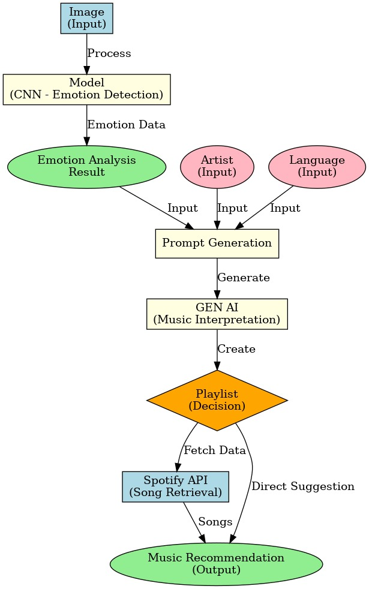
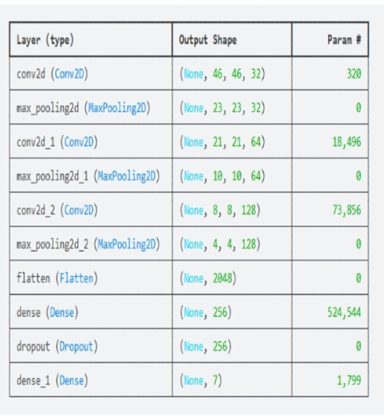
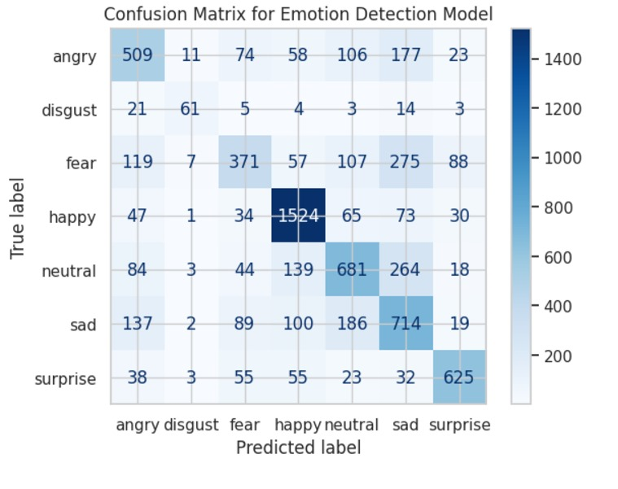

# Emotion-Driven Music Recommendation System (EDM-Playlist AI)

## Overview
EDM-Playlist AI is an advanced music recommendation system that leverages facial emotion recognition and natural language processing to personalize music playlists for users. By analyzing user emotions via facial expressions and integrating nuanced emotion interpretation through a Large Language Model (LLM), the system creates highly tailored music suggestions.

---

## Features
- **Facial Emotion Recognition:** Utilizes a Convolutional Neural Network (CNN) to detect basic human emotions (e.g., happy, sad, neutral) from images.
- **Natural Language Understanding:** Employs LLMs to interpret emotional data and user preferences for refined music recommendations.
- **Dynamic Music Playlist Generation:** Integrates with Spotify API to fetch and curate personalized playlists based on detected emotions.
- **User Management:** Supports user registration, login, and Spotify account integration for personalized experiences.
- **Customization:** Users can select their preferred artist and language for further personalized recommendations.

---

## Technologies Used
- **Frontend:** React.js for a dynamic and user-friendly interface.
- **Backend:** Flask for managing the server-side logic.
- **Machine Learning:**
  - TensorFlow/Keras for building and training the CNN model.
  - LLMs (e.g., GPT-based models) for generating nuanced emotional profiles.
- **API Integration:** Spotify API for fetching and suggesting music.
- **User Authentication:** Flask-JWT-Extended for secure user login and registration.

---

## System Workflow
1. **User Registration and Login:**
   - Users register an account and log in to access the application.
   - Integration with Spotify API allows users to log in to their Spotify account for music personalization.
2. **Emotion Detection:**
   - Users upload or capture an image via the interface.
   - The CNN model processes the image to identify the user's current emotional state.
3. **Data Interpretation:**
   - The detected emotion, along with inputs such as user preferences, artist, and language, is processed by the LLM to generate a prompt.
   - GEN AI generates a nuanced emotional profile.
4. **Music Recommendation:**
   - Based on the emotional profile, the system interacts with the Spotify API to retrieve appropriate music recommendations.
   - The curated playlist is displayed to the user.
   

---

## Installation and Setup

### Prerequisites
- Python 3.8+
- Node.js and npm
- Spotify Developer Account for API access

### Steps
1. Clone the repository:
   ```bash
   git clone <repository_url>
   cd <repository_folder>
   ```
2. Set up the backend:
   ```bash
   cd backend
   pip install -r requirements.txt
   flask run
   ```
3. Set up the frontend:
   ```bash
   cd frontend
   npm install
   npm start
   ```
4. Configure the Spotify API:
   - Obtain API credentials from the Spotify Developer Dashboard.
   - Add the credentials to the `.env` file in the backend folder.
5. Set up the user authentication:
   - Ensure the `extensions.py` file includes configurations for JWT.
   - Add environment variables for JWT secret keys.

---

## Dataset
- **Facial Emotion Recognition Dataset (FER-2013):** Used for training the CNN model to classify emotions.


- **Model**


- **Results**


---

## Usage
1. Register and log in to your account.
2. Connect your Spotify account.
3. Select your preferred artist and language.
4. Capture or upload an image.
5. View the detected emotion and generated playlist tailored to your mood and preferences.

---

## Future Enhancements
- **Multi-language Support:** Enable support for multiple languages in emotion interpretation.
- **Feedback Loop:** Integrate user feedback to refine playlist recommendations.
- **Advanced Emotion Categories:** Expand emotion detection to include complex emotions like nostalgia or excitement.

---


## License
This project is licensed under the [MIT License](LICENSE).

---

## Acknowledgments
Special thanks to the creators of the FER-2013 dataset, Spotify API, and open-source libraries and geminiai that made this project possible.
